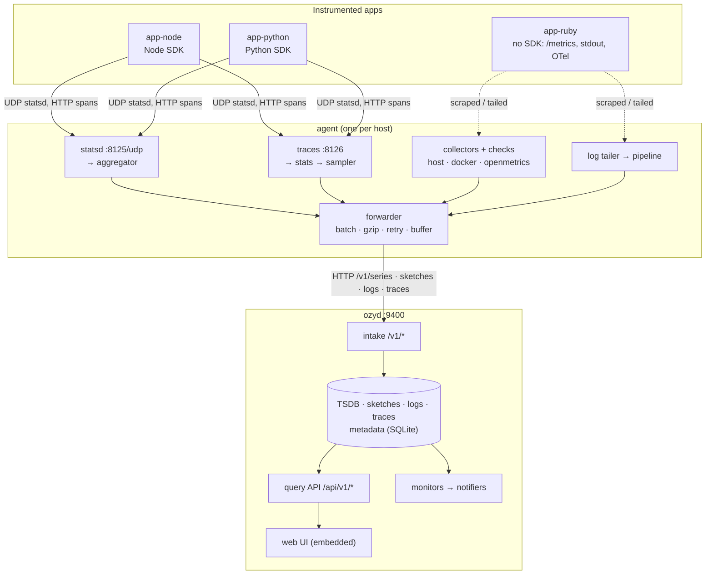
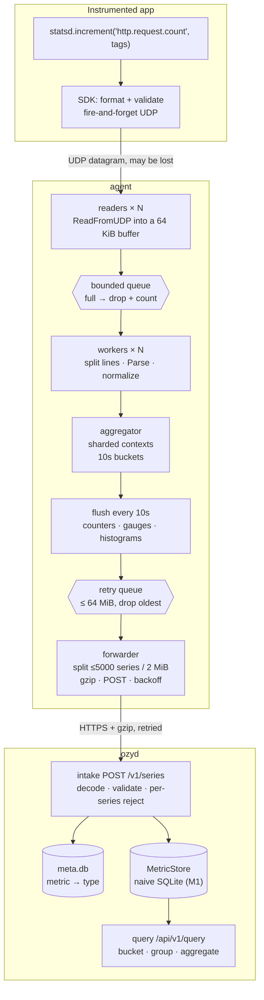

# ozymandias — design, as built

How the system works **today**. [PLAN.md](PLAN.md) and [docs/plan/](docs/plan/)
say what is planned; this file describes what exists. It grows with every
milestone, and a section still waiting for its milestone says so. Decisions
and the alternatives they beat are in [docs/adr/](docs/adr/).

**Status: M1 (metrics tracer bullet).** One metric type flows end to end: a
statsd counter from an app reaches the agent, is aggregated, forwarded, stored
and queried back through the UI. Logs, traces, monitors and the real TSDB are
still ahead.

---

## 1. System overview



(Source: [docs/diagrams/system-overview.mmd](docs/diagrams/system-overview.mmd);
the two copies are kept identical.) This is the target shape. As of M1 the
statsd path through it is real — SDK → aggregator → forwarder → intake →
store → query API → UI (§9) — and the rest is still process boundaries:
`/healthz`, `/debug/vars`, and the UI's remaining sections.

There are two binaries (ADR-0004):

- **agent** runs one per host, close to the apps. It aggregates, collects,
  samples and forwards, so apps never wait on the network and the server sees
  a fraction of the raw volume.
- **ozyd** is intake, storage, query, monitors and UI in one process,
  with hard interfaces between them so M7 can put a queue between intake and
  storage.

## 2. Code layout and layering

```
cmd/{ozyd,agent}   main: signals → internal/cli. Nothing else.
internal/cli            flags, config loading, exit codes, `healthcheck`
internal/server         wires ozyd's components onto one HTTP mux
internal/agent          wires the agent's pipeline stages
internal/agent/<stage>  statsd, aggregator, collector, … (M1+)
internal/api            HTTP API and the embedded SPA handler
internal/config         layered config loader + ozyd's settings
internal/httpserve      graceful serve, request metrics, health, probe
internal/selfmetrics    the ozymandias.* registry
internal/clock          time as a dependency
internal/testutil       fake clock, Eventually, goroutine-leak check
pkg/wire                payload types shared by agent and server (M1)
web/                    the UI (built into internal/api/ui/dist)
```

Dependencies point downward: `cli` → `server`/`agent` → components →
`httpserve`/`selfmetrics`/`clock`. Packages whose milestone hasn't arrived
exist as a `doc.go` describing their job, so the architecture reads
end to end from day one.

Every component takes its collaborators in a constructor (`Options` with
production defaults for zero values). Nothing reads the global clock, the
global registry or the process environment directly, which is what lets
every test run hermetically and in parallel.

## 3. Configuration

[ADR-0009](docs/adr/0009-layered-config-with-strict-files.md) records the
reasoning. In short:

```
built-in defaults  <  -config FILE  <  conf.d/*.yaml (agent)  <  environment
```

- **Files are strict.** An unknown key fails startup with its file and line.
- **The agent's conf.d fragments** (`deploy/agent.d/<app>.yaml`) merge
  structurally: maps merge, lists append in file-name order, and a scalar set
  twice is an error naming both files. A null value, or a file of only
  comments, counts as absent. This is how an app is onboarded without editing
  a shared file (ADR-0008).
- **The environment overrides any leaf** as `OZY_<PATH>` or
  `OZY_AGENT_<PATH>`. An unknown prefixed variable is a warning, not an
  error, because the SDKs' `OZY_AGENT_HOST` shares the agent's prefix.
- The agent loads twice: first to learn `confd_path`, then with every layer.

The reference files [deploy/ozyd.yaml](deploy/ozyd.yaml) and
[deploy/agent.yaml](deploy/agent.yaml) list every key with its default.
`scripts/check-docs.sh` fails CI if a config field is missing from them.

## 4. Process lifecycle

- **Startup** fails fast and says why. A config error exits 2 with the
  message. An unusable `data_dir` or an unresolvable hostname (agent) exits 1
  before listening.
- **Shutdown** on SIGTERM or SIGINT: the listener closes at once, in-flight
  requests get `http.shutdown_timeout` (10s) to finish, and anything still
  running is then cut. This matters most for the intake, where the request
  being cut is an agent's batch (`internal/httpserve.Serve`). Compose gives
  15s before SIGKILL. The smoke test checks each container exits 0 on
  SIGTERM.
- **Health**: `GET /healthz` is liveness only (readiness arrives in M7). The
  images are distroless, with no shell or curl, so each binary checks itself:
  `ozyd healthcheck` reads the same config, finds its own address and
  probes it over loopback.

## 5. Self-observability

`internal/selfmetrics` is a small registry of counters and gauges named
`ozymandias.*`: get-or-create by name and tag set, lock-free updates, and a
sorted JSON snapshot at `GET /debug/vars`. Every HTTP request is counted by
matched route pattern, never the raw path, which would create a series per
URL. The full list is in [docs/metrics-catalog.md](docs/metrics-catalog.md).
Both binaries now ship these through the metric path itself, tagged
`host:<name>`: the agent adds them to each flush, and ozyd feeds its own
straight into the intake every 10s. ozymandias watching itself with its own
pipeline is the cheapest possible end-to-end test — if the graphs are empty,
the pipeline is broken.

## 6. Web UI

A single-page app (ADR-0006) built by Vite into `internal/api/ui/dist` and
embedded with `go:embed`. `internal/api.UI` serves it as follows:

- Real files are served as-is. Hashed `/assets/*` files get a one-year
  immutable cache, and a missing hashed asset is a real 404.
- Every other path gets `index.html` with `no-cache`, so deep links survive a
  reload and a new build is picked up.
- Without a UI build, the embed holds only a tracked `.gitkeep`, and `/`
  explains how to build it. `go build` never needs Node.

The UI shows every planned section with its milestone, ozyd's live
health on the home page, and (M1) a working Metrics Explorer at
`/metrics/explorer`: metric and tag autocomplete, filter chips, group-by,
aggregator, time range and a uPlot chart, with the whole query state in the
URL so a graph can be pasted into a message.

## 7. Deployment

One image with two entry points
([Dockerfile](Dockerfile)): the UI is built in a Node stage, then static Go
binaries with the UI embedded go onto `distroless/static:nonroot`, about
28 MB. [deploy/docker-compose.yml](deploy/docker-compose.yml) runs
`ozyd` (volume `ozymandias-data` at `/data`) and `agent` on the external
network `ozymandias`, which the apps' containers join to reach the agent as
`agent`. Operating details, including the Colima UDP limitation, are in
[docs/operations.md](docs/operations.md).

## 8. Testing and CI

The standard is [docs/plan/testing.md](docs/plan/testing.md). There is no
remote CI (ADR-0010). The git hooks are the gate: pre-commit runs the fast
gates for whatever is staged, and pre-push runs the full `make ci`.
`make smoke` exercises the real compose stack end to end, and its output goes
in the PR.

---

## 9. Metric write path



(Source: [docs/diagrams/metric-write-path.mmd](docs/diagrams/metric-write-path.mmd);
the two copies are kept identical.)

The shape of the whole path follows from one decision: **the app must never
wait.** Everything downstream of `increment()` is allowed to lose data under
pressure, and each stage is explicit about how.

1. **The SDK** formats one line per call and writes a UDP datagram
   (`docs/wire-protocol.md` §A). No connection, no reply, no retry — a send
   into a full socket buffer is dropped and the app never learns. That is the
   trade: instrumentation cannot slow down or break the thing it measures.
   Both SDKs wrap every public entry point so a bug in them cannot throw into
   the host app.
2. **The readers** (`internal/agent/statsd`) each own a `ReadFromUDP` loop.
   More than one, because a single goroutine cannot drain a busy socket, and
   the kernel drops what it cannot hand over. A datagram may hold many
   newline-separated lines; batching is what makes 50k msgs/s only 2.5k
   datagrams/s.
3. **The queue** between readers and workers is bounded. When it fills, the
   reader drops the datagram and counts it
   (`ozy.agent.statsd.packets_dropped`). An unbounded queue would trade
   a visible, counted drop for an invisible memory leak.
4. **The workers** split lines and call `Parse`, which allocates nothing: the
   `Message` aliases the read buffer. Unknown sections (`|c:` container id,
   `|card:`) are ignored rather than rejected, because a receiver that rejects
   what it does not understand breaks every time a client gains a feature.
   Names and tags are normalized here, not rejected — a stray `-` costs a
   cosmetic `_` (`pkg/wire`).
5. **The aggregator** is where volume collapses. See §10.
6. **The forwarder** takes each flush, splits it into payloads of at most
   5000 series or 2 MiB, gzips them, and POSTs them to `/v1/series`. Failures
   go back on a queue capped at 64 MiB that drops *oldest* first, and are
   retried with full-jitter backoff from 1s to 60s, honouring `Retry-After`.
   Only network errors, 408, 429 and 5xx are retried; any other 4xx is the
   agent's own fault and retrying it would just repeat the mistake.
7. **The intake** (`internal/intake`) validates each series independently and
   rejects only the bad ones, returning a per-series reason. An all-or-nothing
   batch would let one malformed series from one app discard another app's
   data. A storage failure is a 503 — the one case where the agent *should*
   retry.
8. **The meta DB** records the first type seen for a metric name and rejects
   later contradictions (`ErrTypeConflict`), so `x` cannot be a counter on one
   host and a gauge on another.

Shutdown runs this pipeline in reverse: the statsd listener stops, the
aggregator does a final flush of every open bucket, and the forwarder gets one
last attempt within its budget. The agent must therefore stop *before*
ozyd, or that final flush has nowhere to go — `make dev` and compose both
encode that order.

## 10. Aggregation model

The agent sends one point per series per 10 seconds, no matter how many times
the app called `increment()`. At 50k msgs/s across 100 series that is 3M
messages reduced to 10 points per flush. This is the single largest reason a
real agent exists at all.

- **Context.** A context is `kind + name + canonical tags`; tags are sorted
  and de-duplicated, so the same tags in any order are the same series. The
  map of contexts is sharded to spread lock contention across the workers.
- **Buckets** are `floor(ts/10)*10`. A flush closes every bucket that started
  before `now`, and leaves the current one open.
- **Late samples.** A sample older than the watermark goes into the oldest
  still-open bucket rather than being dropped. It is a small lie about *when*,
  chosen over a certain loss of *what*. The watermark is read under the shard
  lock so a concurrent flush cannot race it.
- **Counters** are summed, divided by the sample rate, and then **zero-filled**
  until `lastData + expiry`: a counter that stops incrementing keeps reporting
  0, because a gap in a rate chart should mean "no data", while "nothing
  happened" should be a visible zero. The fill jumps over long idle gaps
  rather than emitting thousands of zeros for a context that was quiet all
  night — a bug this code had, found by a test with a fake clock.
- **Gauges** are last-write-wins within the bucket and are **never** filled. A
  gauge's absence means "unknown", not "zero"; filling would invent a reading
  nobody took.
- **Histograms** (`h`, `ms`, `d`) keep a bounded reservoir sampled with
  Algorithm R, and emit `.avg`, `.min`, `.max`, `.median`, `.95percentile` and
  `.count` as separate series. Percentiles use nearest-rank on the reservoir,
  so they are estimates from a sample, not from every value — production agents
  sends sketches instead, which M2 adds.
- **Expiry.** A context with no data and no pending zero-fill is dropped after
  the expiry window, so a process that emitted one metric once does not cost
  memory forever.
- **Sets** count distinct members within the bucket and emit a gauge.

The flush is driven by a `Clock` interface, so every one of these rules is
tested by advancing a fake clock rather than by sleeping.

---

*Sections added by later milestones: TSDB internals (M2), query pipeline (M3),
log path (M4), traces (M5), monitors (M6), the queued pipeline (M7),
OTLP (M8).*
