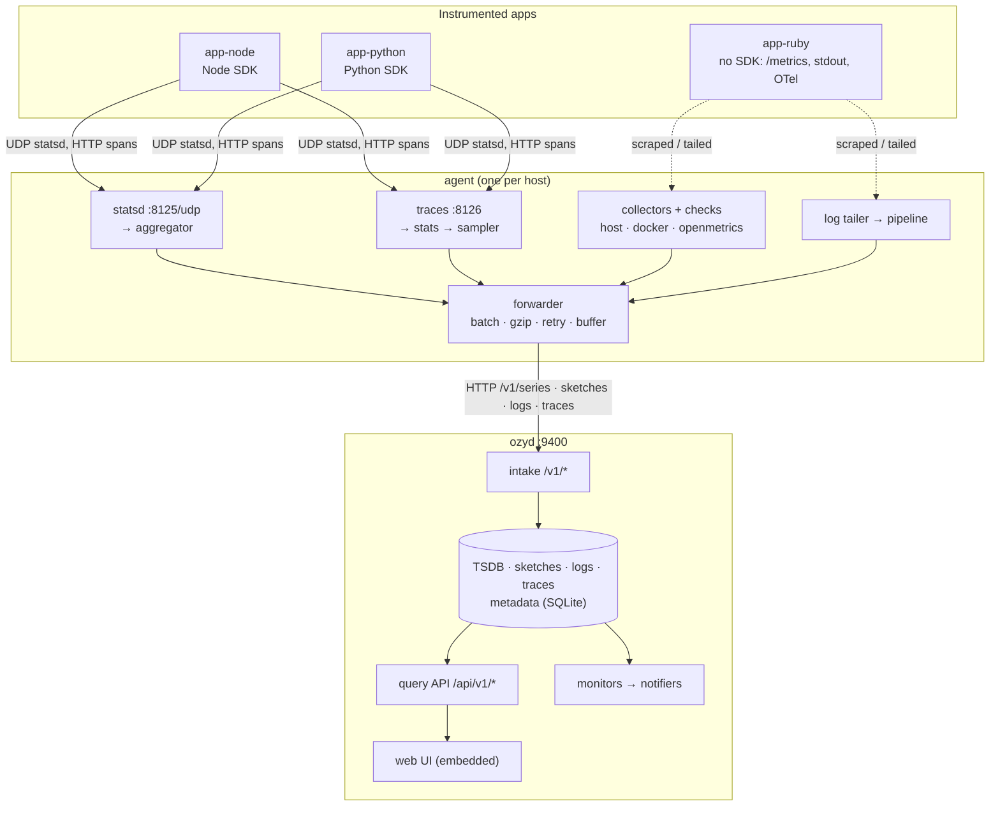

# ozymandias — design, as built

How the system works **today**. [PLAN.md](PLAN.md) and [docs/plan/](docs/plan/)
say what is planned; this file describes what exists. It grows with every
milestone, and a section still waiting for its milestone says so. Decisions
and the alternatives they beat are in [docs/adr/](docs/adr/).

**Status: M0 (skeleton).** Both binaries run, load configuration and report
their health. No telemetry flows yet.

---

## 1. System overview



(Source: [docs/diagrams/system-overview.mmd](docs/diagrams/system-overview.mmd);
the two copies are kept identical.) This is the target shape. As of M0 only
the process boundaries exist: the agent and ozyd each serve `/healthz`
and `/debug/vars`, and ozyd serves the UI shell.

There are two binaries (ADR-0004):

- **agent** runs one per host, close to the apps. It aggregates, collects,
  samples and forwards, so apps never wait on the network and the server sees
  a fraction of the raw volume.
- **ozyd** is intake, storage, query, monitors and UI in one process,
  with hard interfaces between them so M7 can put a queue between intake and
  storage.

## 2. Code layout and layering

```
cmd/{ozyd,agent}   main: signals → internal/cli. Nothing else.
internal/cli            flags, config loading, exit codes, `healthcheck`
internal/server         wires ozyd's components onto one HTTP mux
internal/agent          wires the agent's pipeline stages
internal/agent/<stage>  statsd, aggregator, collector, … (M1+)
internal/api            HTTP API and the embedded SPA handler
internal/config         layered config loader + ozyd's settings
internal/httpserve      graceful serve, request metrics, health, probe
internal/selfmetrics    the ozymandias.* registry
internal/clock          time as a dependency
internal/testutil       fake clock, Eventually, goroutine-leak check
pkg/wire                payload types shared by agent and server (M1)
web/                    the UI (built into internal/api/ui/dist)
```

Dependencies point downward: `cli` → `server`/`agent` → components →
`httpserve`/`selfmetrics`/`clock`. Packages whose milestone hasn't arrived
exist as a `doc.go` describing their job, so the architecture reads
end to end from day one.

Every component takes its collaborators in a constructor (`Options` with
production defaults for zero values). Nothing reads the global clock, the
global registry or the process environment directly, which is what lets
every test run hermetically and in parallel.

## 3. Configuration

[ADR-0009](docs/adr/0009-layered-config-with-strict-files.md) records the
reasoning. In short:

```
built-in defaults  <  -config FILE  <  conf.d/*.yaml (agent)  <  environment
```

- **Files are strict.** An unknown key fails startup with its file and line.
- **The agent's conf.d fragments** (`deploy/agent.d/<app>.yaml`) merge
  structurally: maps merge, lists append in file-name order, and a scalar set
  twice is an error naming both files. A null value, or a file of only
  comments, counts as absent. This is how an app is onboarded without editing
  a shared file (ADR-0008).
- **The environment overrides any leaf** as `OZY_<PATH>` or
  `OZY_AGENT_<PATH>`. An unknown prefixed variable is a warning, not an
  error, because the SDKs' `OZY_AGENT_HOST` shares the agent's prefix.
- The agent loads twice: first to learn `confd_path`, then with every layer.

The reference files [deploy/ozyd.yaml](deploy/ozyd.yaml) and
[deploy/agent.yaml](deploy/agent.yaml) list every key with its default.
`scripts/check-docs.sh` fails CI if a config field is missing from them.

## 4. Process lifecycle

- **Startup** fails fast and says why. A config error exits 2 with the
  message. An unusable `data_dir` or an unresolvable hostname (agent) exits 1
  before listening.
- **Shutdown** on SIGTERM or SIGINT: the listener closes at once, in-flight
  requests get `http.shutdown_timeout` (10s) to finish, and anything still
  running is then cut. This matters most for the intake, where the request
  being cut is an agent's batch (`internal/httpserve.Serve`). Compose gives
  15s before SIGKILL. The smoke test checks each container exits 0 on
  SIGTERM.
- **Health**: `GET /healthz` is liveness only (readiness arrives in M7). The
  images are distroless, with no shell or curl, so each binary checks itself:
  `ozyd healthcheck` reads the same config, finds its own address and
  probes it over loopback.

## 5. Self-observability

`internal/selfmetrics` is a small registry of counters and gauges named
`ozymandias.*`: get-or-create by name and tag set, lock-free updates, and a
sorted JSON snapshot at `GET /debug/vars`. Every HTTP request is counted by
matched route pattern, never the raw path, which would create a series per
URL. The full list is in [docs/metrics-catalog.md](docs/metrics-catalog.md).
From M1 the agent ships these through its own pipeline.

## 6. Web UI

A single-page app (ADR-0006) built by Vite into `internal/api/ui/dist` and
embedded with `go:embed`. `internal/api.UI` serves it as follows:

- Real files are served as-is. Hashed `/assets/*` files get a one-year
  immutable cache, and a missing hashed asset is a real 404.
- Every other path gets `index.html` with `no-cache`, so deep links survive a
  reload and a new build is picked up.
- Without a UI build, the embed holds only a tracked `.gitkeep`, and `/`
  explains how to build it. `go build` never needs Node.

In M0 the UI shows every planned section with its milestone, and ozyd's
live health on the home page.

## 7. Deployment

One image with two entry points
([Dockerfile](Dockerfile)): the UI is built in a Node stage, then static Go
binaries with the UI embedded go onto `distroless/static:nonroot`, about
28 MB. [deploy/docker-compose.yml](deploy/docker-compose.yml) runs
`ozyd` (volume `ozymandias-data` at `/data`) and `agent` on the external
network `ozymandias`, which the apps' containers join to reach the agent as
`agent`. Operating details, including the Colima UDP limitation, are in
[docs/operations.md](docs/operations.md).

## 8. Testing and CI

The standard is [docs/plan/testing.md](docs/plan/testing.md). There is no
remote CI (ADR-0010). The git hooks are the gate: pre-commit runs the fast
gates for whatever is staged, and pre-push runs the full `make ci`.
`make smoke` exercises the real compose stack end to end, and its output goes
in the PR.

---

*Sections added by later milestones: metric write path and aggregation (M1),
TSDB internals (M2), query pipeline (M3), log path (M4), traces (M5),
monitors (M6), the queued pipeline (M7), OTLP (M8).*
