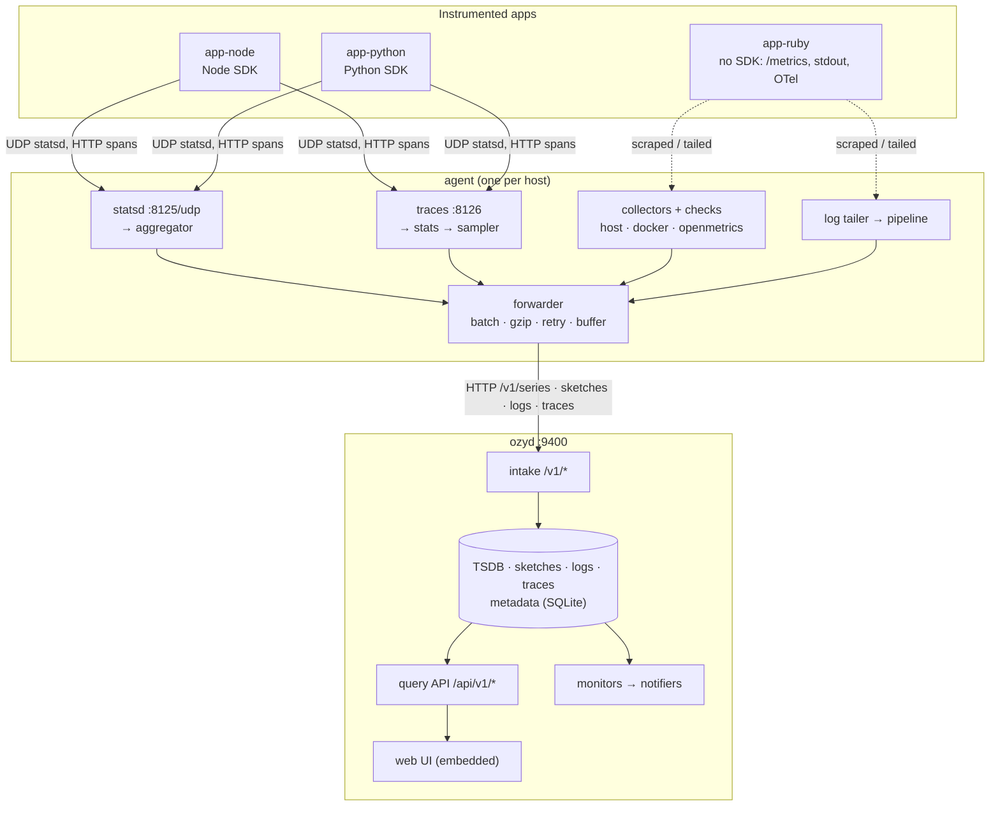
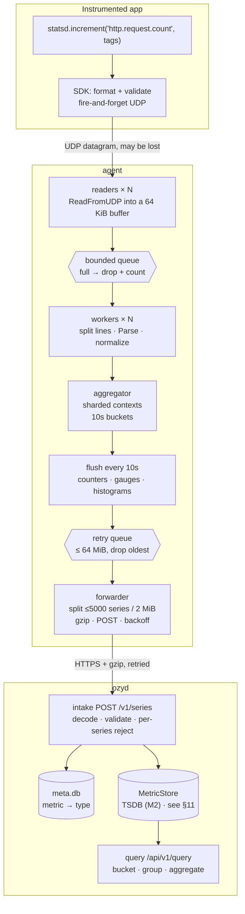
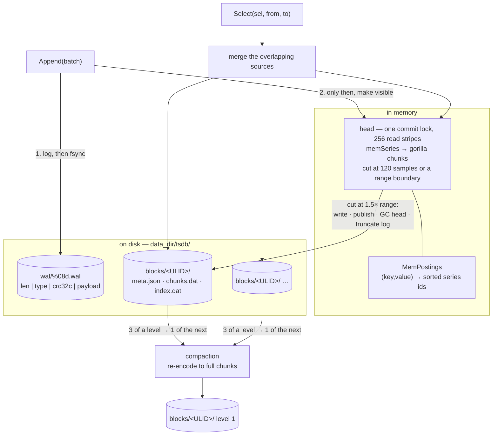
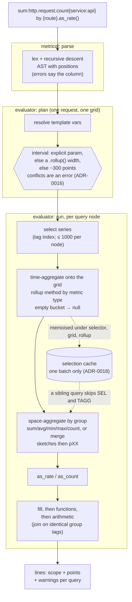
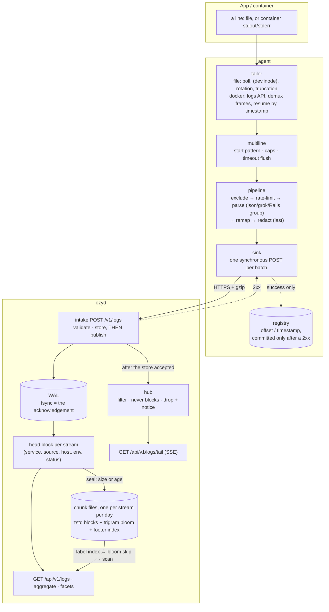

# ozymandias — design, as built

How the system works **today**. [PLAN.md](PLAN.md) and [docs/plan/](docs/plan/)
say what is planned; this file describes what exists. It grows with every
milestone, and a section still waiting for its milestone says so. Decisions
and the alternatives they beat are in [docs/adr/](docs/adr/).

**Status: M4 (logs).** Metrics flow end to end (a statsd counter from an app reaches
the agent, is aggregated, forwarded, stored in the real TSDB (§11), and is queried back
through the UI with metricql and dashboards), and so do logs (§14): files and container
output are tailed, parsed, redacted, stored in an index-light store and searched or
live-tailed in the Log Explorer. Traces and monitors are still ahead.

---

## 1. System overview


```mermaid
flowchart TB
    subgraph apps["Instrumented apps"]
        CB["app-node<br/>Node SDK"]
        LC["app-python<br/>Python SDK"]
        BG["app-ruby<br/>no SDK: /metrics, stdout, OTel"]
    end

    subgraph agent["agent (one per host)"]
        SD["statsd :8125/udp<br/>→ aggregator"]
        TR["traces :8126<br/>→ stats → sampler"]
        CO["collectors + checks<br/>host · docker · openmetrics"]
        TA["log tailer → pipeline"]
        FW["forwarder<br/>batch · gzip · retry · buffer"]
    end

    subgraph dd["ozyd :9400"]
        IN["intake /v1/*"]
        ST[("TSDB · sketches · logs · traces<br/>metadata (SQLite)")]
        Q["query API /api/v1/*"]
        MO["monitors → notifiers"]
        UI["web UI (embedded)"]
    end

    CB -- "UDP statsd, HTTP spans" --> SD & TR
    LC -- "UDP statsd, HTTP spans" --> SD & TR
    BG -. "scraped / tailed" .-> CO & TA
    SD & TR & CO & TA --> FW
    FW -- "HTTP /v1/series · sketches · logs · traces" --> IN
    IN --> ST
    ST --> Q --> UI
    ST --> MO
```

(Source: [docs/diagrams/system-overview.mmd](docs/diagrams/system-overview.mmd);
the two copies are kept identical.) This is the target shape. As of M1 the
statsd path through it is real — SDK → aggregator → forwarder → intake →
store → query API → UI (§9) — and the rest is still process boundaries:
`/healthz`, `/debug/vars`, and the UI's remaining sections.

There are two binaries (ADR-0004):

- **agent** runs one per host, close to the apps. It aggregates, collects,
  samples and forwards, so apps never wait on the network and the server sees
  a fraction of the raw volume.
- **ozyd** is intake, storage, query, monitors and UI in one process,
  with hard interfaces between them so M7 can put a queue between intake and
  storage.

## 2. Code layout and layering

```
cmd/{ozyd,agent}   main: signals → internal/cli. Nothing else.
internal/cli            flags, config loading, exit codes, `healthcheck`
internal/server         wires ozyd's components onto one HTTP mux
internal/agent          wires the agent's pipeline stages
internal/agent/<stage>  statsd, aggregator, collector, … (M1+)
internal/api            HTTP API and the embedded SPA handler
internal/config         layered config loader + ozyd's settings
internal/httpserve      graceful serve, request metrics, health, probe
internal/selfmetrics    the ozy.* registry
internal/clock          time as a dependency
internal/testutil       fake clock, Eventually, goroutine-leak check
pkg/wire                payload types shared by agent and server (M1)
web/                    the UI (built into internal/api/ui/dist)
```

Dependencies point downward: `cli` → `server`/`agent` → components →
`httpserve`/`selfmetrics`/`clock`. Packages whose milestone hasn't arrived
exist as a `doc.go` describing their job, so the architecture reads
end to end from day one.

Every component takes its collaborators in a constructor (`Options` with
production defaults for zero values). Nothing reads the global clock, the
global registry or the process environment directly, which is what lets
every test run hermetically and in parallel.

## 3. Configuration

[ADR-0009](docs/adr/0009-layered-config-with-strict-files.md) records the
reasoning. In short:

```
built-in defaults  <  -config FILE  <  conf.d/*.yaml (agent)  <  environment
```

- **Files are strict.** An unknown key fails startup with its file and line.
- **The agent's conf.d fragments** (`deploy/agent.d/<app>.yaml`) merge
  structurally: maps merge, lists append in file-name order, and a scalar set
  twice is an error naming both files. A null value, or a file of only
  comments, counts as absent. This is how an app is onboarded without editing
  a shared file (ADR-0008).
- **The environment overrides any leaf** as `OZY_<PATH>` or
  `OZY_AGENT_<PATH>`. An unknown prefixed variable is a warning, not an
  error, because the SDKs' `OZY_AGENT_HOST` shares the agent's prefix.
- The agent loads twice: first to learn `confd_path`, then with every layer.

The reference files [deploy/ozyd.yaml](deploy/ozyd.yaml) and
[deploy/agent.yaml](deploy/agent.yaml) list every key with its default.
`scripts/check-docs.sh` fails CI if a config field is missing from them.

## 4. Process lifecycle

- **Startup** fails fast and says why. A config error exits 2 with the
  message. An unusable `data_dir` or an unresolvable hostname (agent) exits 1
  before listening.
- **Shutdown** on SIGTERM or SIGINT: the listener closes at once, in-flight
  requests get `http.shutdown_timeout` (10s) to finish, and anything still
  running is then cut. This matters most for the intake, where the request
  being cut is an agent's batch (`internal/httpserve.Serve`). Compose gives
  15s before SIGKILL. The smoke test checks each container exits 0 on
  SIGTERM.
- **Health**: `GET /healthz` is liveness only (readiness arrives in M7). The
  images are distroless, with no shell or curl, so each binary checks itself:
  `ozyd healthcheck` reads the same config, finds its own address and
  probes it over loopback.

## 5. Self-observability

`internal/selfmetrics` is a small registry of counters and gauges named
`ozy.*`: get-or-create by name and tag set, lock-free updates, and a
sorted JSON snapshot at `GET /debug/vars`. Every HTTP request is counted by
matched route pattern, never the raw path, which would create a series per
URL. The full list is in [docs/metrics-catalog.md](docs/metrics-catalog.md).
Both binaries now ship these through the metric path itself, tagged
`host:<name>`: the agent adds them to each flush, and ozyd feeds its own
straight into the intake every 10s. ozymandias watching itself with its own
pipeline is the cheapest possible end-to-end test — if the graphs are empty,
the pipeline is broken.

## 6. Web UI

A single-page app (ADR-0006) built by Vite into `internal/api/ui/dist` and
embedded with `go:embed`. `internal/api.UI` serves it as follows:

- Real files are served as-is. Hashed `/assets/*` files get a one-year
  immutable cache, and a missing hashed asset is a real 404.
- Every other path gets `index.html` with `no-cache`, so deep links survive a
  reload and a new build is picked up.
- Without a UI build, the embed holds only a tracked `.gitkeep`, and `/`
  explains how to build it. `go build` never needs Node.

The UI shows every planned section with its milestone, ozyd's live
health on the home page, and (M1) a working Metrics Explorer at
`/metrics/explorer`: metric and tag autocomplete, filter chips, group-by,
aggregator, time range and a uPlot chart, with the whole query state in the
URL so a graph can be pasted into a message.

## 7. Deployment

One image with two entry points
([Dockerfile](Dockerfile)): the UI is built in a Node stage, then static Go
binaries with the UI embedded go onto `distroless/static:nonroot`, about
28 MB. [deploy/docker-compose.yml](deploy/docker-compose.yml) runs
`ozyd` (volume `ozymandias-data` at `/data`) and `agent` on the external
network `ozymandias`, which the apps' containers join to reach the agent as
`agent`. Operating details, including the Colima UDP limitation, are in
[docs/operations.md](docs/operations.md).

## 8. Testing and CI

The standard is [docs/plan/testing.md](docs/plan/testing.md). Two gates
(ADR-0024). The pre-commit hook is the fast one: it runs the checks for
whatever is staged. GitHub Actions is the full one: it runs the checks `make
ci` runs, plus a web production build, on every pull request from a clean
checkout as a required check, and on main after each merge. `make ci` is
run by hand once before a pull request.
`make smoke` exercises the real compose stack end to end; it needs docker, so
it stays manual and its output goes in the PR.

---

## 9. Metric write path


```mermaid
flowchart TB
    subgraph app["Instrumented app"]
        CALL["statsd.increment('http.request.count', tags)"]
        FMT["SDK: format + validate<br/>fire-and-forget UDP"]
    end

    subgraph ag["agent"]
        direction TB
        RD["readers × N<br/>ReadFromUDP into a 64 KiB buffer"]
        Q{{"bounded queue<br/>full → drop + count"}}
        WK["workers × N<br/>split lines · Parse · normalize"]
        AGG["aggregator<br/>sharded contexts<br/>10s buckets"]
        FLUSH["flush every 10s<br/>counters · gauges · histograms"]
        FWQ{{"retry queue<br/>≤ 64 MiB, drop oldest"}}
        FW["forwarder<br/>split ≤5000 series / 2 MiB<br/>gzip · POST · backoff"]
    end

    subgraph dd["ozyd"]
        IN["intake POST /v1/series<br/>decode · validate · per-series reject"]
        META[("meta.db<br/>metric → type")]
        ST[("MetricStore<br/>TSDB (M2) · see §11")]
        QRY["query /api/v1/query<br/>bucket · group · aggregate"]
    end

    CALL --> FMT -- "UDP datagram, may be lost" --> RD
    RD --> Q --> WK --> AGG --> FLUSH --> FWQ --> FW
    FW -- "HTTPS + gzip, retried" --> IN
    IN --> META & ST
    ST --> QRY
```

(Source: [docs/diagrams/metric-write-path.mmd](docs/diagrams/metric-write-path.mmd);
the two copies are kept identical.)

The shape of the whole path follows from one decision: **the app must never
wait.** Everything downstream of `increment()` is allowed to lose data under
pressure, and each stage is explicit about how.

1. **The SDK** formats one line per call and writes a UDP datagram
   (`docs/wire-protocol.md` §A). No connection, no reply, no retry — a send
   into a full socket buffer is dropped and the app never learns. That is the
   trade: instrumentation cannot slow down or break the thing it measures.
   Both SDKs wrap every public entry point so a bug in them cannot throw into
   the host app.
2. **The readers** (`internal/agent/statsd`) each own a `ReadFromUDP` loop.
   More than one, because a single goroutine cannot drain a busy socket, and
   the kernel drops what it cannot hand over. A datagram may hold many
   newline-separated lines; batching is what makes 50k msgs/s only 2.5k
   datagrams/s.
3. **The queue** between readers and workers is bounded. When it fills, the
   reader drops the datagram and counts it
   (`ozy.agent.statsd.packets_dropped`). An unbounded queue would trade
   a visible, counted drop for an invisible memory leak.
4. **The workers** split lines and call `Parse`, which allocates nothing: the
   `Message` aliases the read buffer. Unknown sections (`|c:` container id,
   `|card:`) are ignored rather than rejected, because a receiver that rejects
   what it does not understand breaks every time a client gains a feature.
   Names and tags are normalized here, not rejected — a stray `-` costs a
   cosmetic `_` (`pkg/wire`).
5. **The aggregator** is where volume collapses. See §10.
6. **The forwarder** takes each flush, splits it into payloads of at most
   5000 series or 2 MiB, gzips them, and POSTs them to `/v1/series`. Failures
   go back on a queue capped at 64 MiB that drops *oldest* first, and are
   retried with full-jitter backoff from 1s to 60s, honouring `Retry-After`.
   Only network errors, 408, 429 and 5xx are retried; any other 4xx is the
   agent's own fault and retrying it would just repeat the mistake.
7. **The intake** (`internal/intake`) validates each series independently and
   rejects only the bad ones, returning a per-series reason. An all-or-nothing
   batch would let one malformed series from one app discard another app's
   data. A storage failure is a 503 — the one case where the agent *should*
   retry.
8. **The meta DB** records the first type seen for a metric name and rejects
   later contradictions (`ErrTypeConflict`), so `x` cannot be a counter on one
   host and a gauge on another.

Shutdown runs this pipeline in reverse: the statsd listener stops, the
aggregator does a final flush of every open bucket that has begun (ADR-0029:
a bucket ahead of now may be the next agent's first), and the forwarder gets one
last attempt within its budget. The agent must therefore stop *before*
ozyd, or that final flush has nowhere to go — `make dev` and compose both
encode that order.

## 10. Aggregation model

The agent sends one point per series per 10 seconds, no matter how many times
the app called `increment()`. At 50k msgs/s across 100 series that is 3M
messages reduced to 10 points per flush. This is the single largest reason a
real agent exists at all.

- **Context.** A context is `kind + name + canonical tags`; tags are sorted
  and de-duplicated, so the same tags in any order are the same series. The
  map of contexts is sharded to spread lock contention across the workers.
- **Buckets** are `floor(ts/10)*10`. A flush closes every bucket that started
  before `now`, and leaves the current one open.
- **Late samples.** A sample older than the watermark goes into the oldest
  still-open bucket rather than being dropped. It is a small lie about *when*,
  chosen over a certain loss of *what*. The watermark is read under the shard
  lock so a concurrent flush cannot race it.
- **Counters** are summed, divided by the sample rate, and then **zero-filled**
  until `lastData + expiry`: a counter that stops incrementing keeps reporting
  0, because a gap in a rate chart should mean "no data", while "nothing
  happened" should be a visible zero. The fill jumps over long idle gaps
  rather than emitting thousands of zeros for a context that was quiet all
  night — a bug this code had, found by a test with a fake clock.
- **Gauges** are last-write-wins within the bucket and are **never** filled. A
  gauge's absence means "unknown", not "zero"; filling would invent a reading
  nobody took.
- **Histograms** (`h`, `ms`, `d`) keep a bounded reservoir sampled with
  Algorithm R, and emit `.avg`, `.min`, `.max`, `.median`, `.95percentile` and
  `.count` as separate series. Percentiles use nearest-rank on the reservoir,
  so they are estimates from a sample, not from every value — production agents
  sends sketches instead, which M2 adds.
- **Expiry.** A context with no data and no pending zero-fill is dropped after
  the expiry window, so a process that emitted one metric once does not cost
  memory forever.
- **Sets** count distinct members within the bucket and emit a gauge.

The flush is driven by a `Clock` interface, so every one of these rules is
tested by advancing a fake clock rather than by sleeping.

## 11. Metric storage engine

`storage.metric_store` chooses between two implementations of one interface.
`naive` is M1's SQLite store — one row per sample — kept as the oracle the real
engine's differential tests are held to. `tsdb` is the default and the subject
of this section.


```mermaid
flowchart TB
    AP["Append(batch)"]

    subgraph mem["in memory"]
        HEAD["head — one commit lock, 256 read stripes<br/>memSeries → gorilla chunks<br/>cut at 120 samples or a range boundary"]
        IDX["MemPostings<br/>(key,value) → sorted series ids"]
    end

    subgraph disk["on disk — data_dir/tsdb/"]
        WAL[("wal/%08d.wal<br/>len | type | crc32c | payload")]
        B1[("blocks/&lt;ULID&gt;/<br/>meta.json · chunks.dat · index.dat")]
        B2[("blocks/&lt;ULID&gt;/ …")]
    end

    AP -- "1. log, then fsync" --> WAL
    AP -- "2. only then, make visible" --> HEAD
    HEAD --- IDX
    HEAD -- "cut at 1.5× range:<br/>write · publish · GC head · truncate log" --> B1
    B1 & B2 -- "3 of a level → 1 of the next" --> CMP["compaction<br/>re-encode to full chunks"]
    CMP --> B3[("blocks/&lt;ULID&gt;/ level 1")]

    QQ["Select(sel, from, to)"] --> MERGE["merge the overlapping sources"]
    MERGE --> HEAD & B1 & B2
```

Three ideas carry it, and each is a trade someone else made first.

1. **The log is for durability, the head is for reading, blocks are for both.**
   A write is appended to the log and fsynced *before* it becomes visible, so
   nothing can be read that would not survive a crash. The head is what makes
   it queryable, and is lost on a crash — replay is how it comes back. Blocks
   are written only in large batches, because that is the only way to produce a
   file that is compact, indexed and immutable.

   Resolving a series, logging it and applying the sample are one critical
   section, so appends to the head are serial. That is what makes the log's
   order the head's order — replay must reconstruct what was visible, not
   something else — and what keeps a block cut from forgetting a series an
   appender is still holding. An fsync inside that section costs four orders of
   magnitude more than the lock, so the throughput lever is batch size, not
   concurrency; `docs/notes/M2.md` has the measurements and the three bugs that
   established the rule.

2. **Compression is delta-of-delta on time, XOR on value** (Facebook's Gorilla,
   `internal/tsdb/chunkenc`). Samples arrive at a fixed interval and change
   slowly, so the second difference of the timestamp is almost always zero —
   one bit — and consecutive float64s usually share their leading bits. A chunk
   is a bitstream, not an array, which is why it is append-only and why
   ADR-0011 exists.

3. **Immutability buys away the hard problems.** A block is never edited: any
   number of concurrent readers with no locking on the data, checksums computed
   once and trusted forever. Compaction does not modify blocks either — it
   writes a new one and deletes the sources. The head is the only mutable data
   in the store. The one piece of bookkeeping a block does keep is a count of
   its readers, so that compaction closing a block it has just replaced cannot
   pull the file out from under a query that is still reading it.

The consequences worth knowing before operating it are in
[docs/operations.md](docs/operations.md): backfill is refused, retention
deletes whole blocks, and `ozy.tsdb.ooo_rejected` is the number that says
data is being dropped.

Formats are specified byte by byte in [docs/formats/](docs/formats/), and the
reasoning behind each package is in its `doc.go`.

## 12. Agent collectors

Statsd is push: applications send, the agent aggregates. Collectors are
pull: the agent goes and reads a source on a timer — the kernel's counters,
the Docker daemon, and the checks a user configures or a container asks for
(M3 §3).

```
Collector.Collect ──emit(Metric)──▶ Scheduler ──[]wire.Series──▶ Forwarder ──▶ ozyd
     (one per source)          (+host, +tags, +timestamp)      (same queue as statsd)
```

- **One goroutine per collector** (`internal/agent/collector`). "A slow or
  failing collector never delays another" then holds by construction rather
  than by careful timeouts: the Docker daemon taking nine seconds holds up
  the Docker collector only. Each starts at a random point in its first
  interval and then runs on a fixed period, so collectors spread out and the
  spacing between two readings — every rate's denominator — is constant.
- **Straight to the forwarder, not through the aggregator.** The aggregator
  exists to combine many samples of one series within a bucket; a collector
  produces one value per series per run already.
- **Rates are computed at collection.** Kernel and container counters are
  cumulative since some start the agent does not control. `collector.Rates`
  differences two readings, yields nothing for a first reading or across a
  counter reset (a skipped interval rather than an invented spike), and
  forgets keys that disappear. Prometheus stores the raw counter and
  computes `rate()` at query time, which keeps the option of any window
  later; storing the rate keeps every query cheap and the store free of
  resets, at the cost of that option. The per-second value is sent as a **gauge**
  (ADR-0026): the query engine sums `rate`-typed points within a bucket, as
  it does counts, and a per-second value must average.
- **Failure is data.** A failed run is counted
  (`ozy.agent.collector.errors`), logged once on the transition into failure
  and once on recovery, and never fatal. A run past `collectors.timeout` is
  cancelled; what it read is still sent.
- **The host collector** reads gopsutil through a narrow `Source` interface,
  so tests can script what no machine produces on demand (a counter reset, a
  vanished interface). CPU percentages are computed from its own total of
  the states, because gopsutil's includes guest time that Linux already
  counts inside user time.
- **The Docker collector and the event watcher** split one source by shape.
  Polling the daemon (list, then stats per container, at most
  `max_concurrency` at once, which bounds the load a run puts on the
  daemon; stats are one-shot, so CPU % is taken between runs, ADR-0030)
  suits levels and rates. It cannot see a container that starts and dies
  between two polls, so a watcher follows the event stream and turns each
  die into `container.exits` and `container.lifetime`. Those samples arrive
  one at a time, at any moment, several per interval: the statsd
  aggregator's shape, so the watcher feeds it rather than the scheduler.
  After a disconnect the watcher resumes from the newest event seen and
  drops the events at that time the daemon replays; what the daemon itself
  no longer has (its own restart empties its buffer) is lost, so
  `container.exits` is a floor. `container_name_rewrite` folds containers that
  are many by design into one name, and same-tagged containers are combined
  (amounts summed) rather than sent as points that overwrite each other.
  Reading the socket is root-equivalent on the Docker host (ADR-0028).
- **Checks** are collectors a user configures: a `collector.Check` is a
  factory, and a `collector.Registry` (an explicit map the agent builds, not
  init-time registration) names them. The registry applies the settings
  every instance shares — name, interval, tags — and the check decodes the
  rest strictly, so a misspelt key fails at startup. Each instance is its own
  collector with its own goroutine and self-metrics, named `<check>:<name>`.
- **Autodiscovery** lists containers every 10s and turns
  `ozy.check.<check>.<setting>` labels into instances, added to and removed
  from the running scheduler (`Scheduler.Add` returns the removal). Label
  values are handed to the check as plain YAML scalars after
  `%%host%%`/`%%port%%` substitution, never parsed, so a port label decodes
  as a number and a password as the text written. Settings are resolved
  every sync, so a container restarted with a new address gets its check
  rebuilt; containers a rewrite folds into one name get `replica:<n>` tags
  (lowest free number), since the same tags would overwrite each other. `%%host%%` is the address on the network the agent shares
  (`autodiscovery_network`), never a guess among several. An instance is
  named after its container's rewritten name: collectors may share a name,
  and share its self-metrics, which the registry frees once the last one
  stops (`Registry.Release`), so names that come and go do not accumulate.
  Configuration then lives with the container, the model Datadog's
  autodiscovery and Prometheus's docker_sd share.
- **Distributions from collectors.** A collector may emit a `Distribution`
  carrying a DDSketch; the scheduler sends it to the forwarder's sketch
  endpoint. The openmetrics check uses it for histograms, so a scraped
  histogram answers `p90:` like a statsd one — as precisely as its buckets
  allow.

## 13. Query pipeline

A query is text: `sum:http.request.count{service:api} by {route}.as_rate()`.
`internal/query/metricql` parses it into an AST that keeps every position, so
an error can say `col 17: expected '}'`. `internal/query/metricql/eval`
answers it. The order of the stages is the whole point, and
[docs/query-language.md](docs/query-language.md) walks each with a numeric
table:

1. **Plan.** One request is evaluated onto *one* grid. The interval is the
   explicit parameter, else a `.rollup()` width, else about 300 points rounded
   up to the agent's 10 s flush; two sources that disagree are an error, never a
   silent pick (ADR-0016).
2. **Select** the series from the tag index, at most 1000 per query node (the
   error says to add a filter or group).
3. **Time-aggregate** each series into the grid's buckets with the rollup method
   its metric type implies. An empty bucket is null, not zero.
4. **Space-aggregate** by group. A series missing a `by` key is grouped under
   its absence: the key is left off that group's tags. `pXX` merges sketches
   first and takes the quantile after, which is why a distribution refuses `avg`
   (you cannot average percentiles).
5. **Modify** (`as_rate`, `as_count`), then **fill**, **functions** and
   **arithmetic**. Binary operators join on identical group tag sets; a group
   with no match is dropped with a warning, and division by zero is null.

A dashboard is one batch request: its widgets share a grid, and the select and
time-aggregate half of a node is memoised for the batch (ADR-0018), because
five widgets over `http.request.count` differ only in how they group. Nothing is
cached between requests, so nothing can be stale.


```mermaid
flowchart TB
    TXT["sum:http.request.count{service:api} by {route}.as_rate()"]

    subgraph parse["metricql: parse"]
        direction TB
        LEX["lex + recursive descent<br/>AST with positions<br/>(errors say the column)"]
    end

    subgraph plan["evaluator: plan (one request, one grid)"]
        direction TB
        VARS["resolve template vars"]
        GRID{{"interval: explicit param,<br/>else a .rollup() width,<br/>else ~300 points<br/>conflicts are an error (ADR-0016)"}}
    end

    subgraph run["evaluator: run, per query node"]
        direction TB
        SEL["select series<br/>(tag index; ≤ 1000 per node)"]
        TAGG["time-aggregate onto the grid<br/>rollup method by metric type<br/>empty bucket → null"]
        CACHE[("selection cache<br/>one batch only (ADR-0018)")]
        SAGG["space-aggregate by group<br/>sum/avg/min/max/count, or merge<br/>sketches then pXX"]
        MOD["as_rate / as_count"]
        FN["fill, then functions,<br/>then arithmetic<br/>(join on identical group tags)"]
    end

    OUT["lines: scope + points<br/>+ warnings per query"]

    TXT --> LEX --> VARS --> GRID --> SEL --> TAGG --> SAGG --> MOD --> FN --> OUT
    TAGG -. "memoised under selector, grid, rollup" .-> CACHE
    CACHE -. "a sibling query skips SEL and TAGG" .-> SAGG
```

(Source: [docs/diagrams/query-pipeline.mmd](docs/diagrams/query-pipeline.mmd);
the two copies are kept identical.)

---

## 14. Log path

A log line takes one of two roads in, and both end in the same store.


```mermaid
%% The path one log line takes, from an app's stdout or file to a search result.
%% Kept identical to the copy in DESIGN.md §14.
flowchart TB
    subgraph app["App / container"]
        LINE["a line: file, or container stdout/stderr"]
    end

    subgraph ag["agent"]
        direction TB
        TAIL["tailer<br/>file: poll, (dev,inode), rotation, truncation<br/>docker: logs API, demux frames, resume by timestamp"]
        ML["multiline<br/>start pattern · caps · timeout flush"]
        PIPE["pipeline<br/>exclude → rate-limit → parse (json/grok/Rails group)<br/>→ remap → redact (last)"]
        SINK["sink<br/>one synchronous POST per batch"]
        REG[("registry<br/>offset / timestamp,<br/>committed only after a 2xx")]
    end

    subgraph dd["ozyd"]
        IN["intake POST /v1/logs<br/>validate · store, THEN publish"]
        WAL[("WAL<br/>fsync = the acknowledgement")]
        HEAD["head block per stream<br/>(service, source, host, env, status)"]
        CHUNK[("chunk files, one per stream per day<br/>zstd blocks + trigram bloom + footer index")]
        HUB["hub<br/>filter · never blocks · drop + notice"]
        API["GET /api/v1/logs · aggregate · facets"]
        SSE["GET /api/v1/logs/tail (SSE)"]
    end

    LINE --> TAIL --> ML --> PIPE --> SINK
    SINK -- "HTTPS + gzip" --> IN
    IN --> WAL --> HEAD -- "seal: size or age" --> CHUNK
    IN -- "after the store accepted" --> HUB --> SSE
    IN -. "2xx" .-> SINK
    SINK -. "success only" .-> REG
    HEAD --> API
    CHUNK -- "label index → bloom skip → scan" --> API
```

(Source: [docs/diagrams/log-path.mmd](docs/diagrams/log-path.mmd); the two copies
are kept identical.)

**Delivery is at-least-once, and the ordering is the proof.** The agent keeps a
registry of how far it has read each file (device+inode, offset) and each
container (timestamp). It writes a position only after `Sink.Send` returned
nil, which is only after ozyd answered `202`, which is only after the batch is
in the WAL and fsynced. A crash anywhere before that repeats the lines; nothing
can skip them. Committing *before* sending would be at-most-once, and silently
losing a line is the failure a log system exists to prevent, so the price is
duplicates, bounded to one batch per crash (`TestFiles_ACrashAtAnyPoint…` kills
the agent at every instant of random runs and counts).

**The tailer is polling, not inotify.** File events do not cross the bind
mounts the agent usually reads through (a Mac's Docker VM), and a poll is the
same code on every platform. The cost is up to one poll interval (1s) of
latency; the measured tail latency end to end through the real stack is 1.1 s.
Rotation is handled by identity, not name: a renamed file keeps its handle open
until it has been idle, so lines written to it after `mv` are not lost, and a
shrunk file is a truncation and restarts at 0.

**The pipeline runs in a fixed order, and redaction is last.** Parsers and
remappers see the raw text (a JWT may be exactly the field a rule keys on);
redaction runs after everything that could *create* a field, so no stage can
re-introduce a secret. The Rails parser groups the interleaved lines of
concurrent requests by request id into one event (`Started`…`Completed`), which
is why a crash can lose a request that was still open: documented, not hidden.

**ozyd stores, then publishes.** `POST /v1/logs` appends to the log store and
only then hands the batch to the live-tail hub; a store error is a `503` with
nothing published, so a tail never shows a log a search cannot find, and the
agent resends the whole batch. The hub never blocks ingest: a subscriber has a
buffer of 1000, and one that falls behind loses logs and is told how many.

**The store is index-light** (ADR-0039). A stream is one label set of five
low-cardinality labels (`service`, `source`, `host`, `env`, `status`; status is
a label because "just the errors" is the first question). Everything else is
found by scanning: the label index selects streams, per-block bloom filters
(ADR-0040) rule out blocks that cannot contain a literal in the query, and the
remaining blocks are decompressed and filtered by the same matcher the tail
uses, so a query means the same thing on stored and arriving logs. This is the
Loki trade (cheap writes and storage, scan-priced search) against
Elasticsearch's (an inverted index over every term: cheap search, expensive
writes and disk). `docs/notes/M4.md` has the measured numbers.

**Retention** deletes whole days (a chunk file is one stream-day), so it is a
file unlink, not a rewrite. A seal writes one block per day for that reason.

---

*Sections added by later milestones: traces (M5), monitors (M6),
the queued pipeline (M7), OTLP (M8).*
