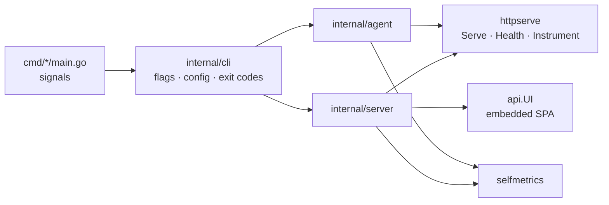

# M0 — Skeleton

## What was built

The M0 repo is empty of telemetry but fully wired. It has two Go binaries
(`ozyd` and `agent`) that load layered configuration, serve `/healthz`
and `/debug/vars`, and shut down gracefully. A React UI shell is embedded in
`ozyd`. One distroless image runs both binaries under a compose stack
with healthchecks. The gates that every later milestone must pass are live
from day one: coverage, docs drift, no app coupling, and fuzz. They run as
git hooks on every commit and push, because there is no remote CI (ADR-0010).



## How it works

Follow one `docker compose up` through the code:

1. The container starts `/usr/local/bin/ozyd -config /etc/ozy/ozyd.yaml`.
   `cmd/ozyd/main.go` wraps the process in a SIGTERM/SIGINT-aware context
   and calls `cli.Ozyd` (`internal/cli/cli.go`).
2. `config.LoadOzyd` (`internal/config/ozyd.go`) starts from
   `DefaultOzyd()`. It strictly decodes the file: an unknown key fails
   with its line. It then applies `OZY_*` from the environment
   (`OZY_DATA_DIR=/data` from the Dockerfile), and validates, collecting
   *every* problem rather than stopping at the first.
3. `server.New` creates `data_dir`, so an unusable one fails before
   listening. It registers the build-info and uptime gauges and mounts
   `/healthz`, `/debug/vars` and the UI on a mux wrapped by
   `httpserve.Instrument`. The wrapper counts each request by route
   *pattern*, never by path.
4. `httpserve.Serve` (`internal/httpserve/httpserve.go`) serves until the
   context ends. On SIGTERM it stops accepting at once and gives in-flight
   requests the grace period. The test
   `TestServe_GracefulShutdownFinishesInFlightAndRefusesNew` proves both
   halves.
5. Docker's healthcheck runs `ozyd healthcheck`. That is the same binary
   and the same config, so it knows its own port, and it probes `/healthz`
   over loopback. No curl is needed in a distroless image.

The agent follows the same path, with one difference: its config loads in two
passes (learn `confd_path`, then load everything), because the conf.d
directory is itself a setting.

## Key concepts learned

- **Precedence needs a conflict rule, not only an order.** "Last writer wins"
  across conf.d fragments would make the result depend on file names. An
  error naming both files is kinder. Lists, though, *should* combine, since
  every app adds its own tags and checks.
- **Strict files, lenient environment.** Files are yours, so typos should
  fail. The environment is shared with other software, so unknown names can
  only warn. The SDKs' `OZY_AGENT_HOST` shares the agent's prefix, and
  treating it as an error would have made the agent unstartable in a
  correctly configured shell.
- **Graceful shutdown is data safety** for an ingest service. The request cut
  off by a redeploy is someone's batch of metrics.
- **Time is a dependency.** Everything in this system is a function of time,
  so nothing reads the wall clock directly. The fake clock turns "wait ten
  seconds and see" into `Advance(10*time.Second)`. It also has to copy Go
  1.23's timer semantics exactly, or tests pass for reasons production
  doesn't share. A review found exactly that bug (see below).
- **Self-observability starts on day one.** The `ozymandias.*` registry exists
  before there's anything to observe, so every later component reports into
  it from its first line.

## Trade-offs taken

| Choice | Cost | When it would be wrong |
|---|---|---|
| Own config loader (~250 lines) instead of viper/koanf | Code to maintain | If config grew templating or remote sources |
| Env overrides only for scalars and string lists | Check instances (M3) must come from files | Never really: structured config belongs in files |
| Distroless, non-root image | No shell to debug with. The Docker socket (M3) needs an explicit access decision | If operators need to `exec` into containers routinely |
| UI embedded in the binary | UI changes need a binary rebuild in production (not in dev) | If the UI were deployed independently, e.g. to a CDN |
| Git hooks as the only CI | Nothing verifies a PR remotely, and `--no-verify` can bypass everything | As soon as Actions minutes are available |

## How the real systems differ

- **Production agents** are usually several processes (a core agent, a trace
  agent, a process agent, a kernel probe), each with its own config file and a
  `conf.d/<check>.d/conf.yaml` per integration. ozymandias's agent is one
  process, and its conf.d holds fragments of *one* config rather than per-check
  files. From M3 the fragments carry check instances, which gets close to that
  per-check layout.
- **Prometheus and Loki** reload config on SIGHUP. ozymandias restarts instead;
  hot reload is a possible later exercise.
- **The `/debug/vars` convention** is Go's `expvar`. ozymandias's registry has
  tags, and from M1 it ships its metrics through its own pipeline, which is
  closer to how a production agent reports its own `*.agent.*` metrics.

## Measured numbers

| What | Value | Command |
|---|---|---|
| `make ci`, cold test cache | 11 s wall | `go clean -testcache && time make ci` |
| Go coverage, total (excl. `main.go`) | 98.1% | `make test` |
| Lowest package | `internal/api/ui` 75% (one unreachable `panic` branch in a 4-line package) | `make test` |
| Web `src/lib` coverage | 100% lines / 97% branches (30 tests) | `cd web && npm run test:coverage` |
| Image size | 27.7 MB (distroless static, two binaries, UI embedded) | `docker images ozymandias` |
| Image build, cold | ~1m55s | `time make up` |
| Smoke | 14 checks in ~21 s | `make smoke` |
| Time to exit on SIGTERM | < 1 s (both) | reported by `make smoke` |

## Surprises and bugs

- **Colima silently drops UDP from the Mac.** Its default `ssh` port forwarder
  is TCP-only. A UDP listener in a container received datagrams from another
  container, but none from the Mac via the published port. For M1, where
  app-node runs on the Mac, statsd would vanish with no error anywhere.
  This is documented in docs/operations.md with three workarounds, and
  flagged at the top of the M1 spec.
- **An npm package ships Go code.** `flatted` includes a Go package, so
  `go list ./...` found it under `web/node_modules`, lint failed on it, and
  the coverage total dropped. Fixed with Go's `ignore` directive in `go.mod`.
- **`.gitignore` swallowed the embed placeholder.** A Python-section `dist/`
  rule matched `internal/api/ui/dist/.gitkeep`, and Vite's `emptyOutDir`
  deletes it on every build. A clean checkout would not have compiled, and
  the tests didn't notice, because they ran in the working tree. Caught by
  building from a fresh `git worktree`. The rule is now scoped, and the build
  recreates the file.
- **A retroactive code review found three bugs** in the first two slices,
  each reproduced by a failing test before the fix (PR #2):
  - A comment-only YAML file failed with a bare `EOF`.
  - A null list (`tags:` with every item commented out) blocked a later
    fragment's list from appending.
  - The fake clock kept stale fires across `Stop`/`Reset`, unlike Go 1.23+
    timers.
- **A second review, of all of M0 before merging, found the first fix's
  own bug.** Once `Stop` and `Reset` discarded an unread fire, they returned
  `false` for that timer. Real Go 1.27 returns `true` (checked with a probe
  program), so the classic `if !t.Stop() { <-t.C }` would have blocked
  forever, but only under the fake. The tests for the first fix checked the
  channel and not the return value.
- **macOS tooling:** bash 3.2 has no `wait -n` and there is no `timeout`
  command. `scripts/dev.sh` polls instead. `npm run dev` wraps Vite in a
  process that swallowed SIGTERM and left Vite running; `exec`-ing Vite
  directly fixed it.
- **The smoke test caught its own side effect.** Its restart step first used
  `compose up`, which recreated the containers without the version and
  hostname variables. The next hostname check failed, correctly. It now
  restarts the existing containers.

## Acceptance evidence

**`make build test lint` green locally and in CI.** Locally, `make ci` passes
in full (numbers above). GitHub CI passed on `main` (lint, test-go, fuzz;
run 35461277062), on PR #1 (lint, test-go, web, fuzz) and on PR #2 (lint,
test-go, fuzz). Then the Actions quota ran out, and the owner chose to keep
the repo private, so remote CI is now manual-only. The git hooks are the gate
(ADR-0010). Each hook was shown to refuse a commit with a failing Go test
(`go-test`, 0.6 s), a TypeScript lint error (`web-lint`, `web-typecheck`), an
app name in the core (`no-app-coupling`), and untested code in `pkg/wire`
(`go-test` → coverage gate).

**`make up` → both `/healthz` OK; the UI is served at `/`.**

```
$ make up && make smoke
✓ ozyd /healthz
✓ agent /healthz
✓ ozyd container healthy
✓ agent container healthy
✓ agent tags data with the Mac's name
✓ agent forwards to ozyd by name
✓ ozyd self-metrics
✓ UI index served
✓ UI deep link falls back to index
✓ UI index is not cached
✓ agent exits 0 on SIGTERM (0s)
✓ ozyd exits 0 on SIGTERM (0s)
✓ ozyd healthy again after restart
✓ agent healthy again after restart
smoke: 14 checks passed
```

**`docker kill -s TERM` exits 0 within 10s.** This is covered by the smoke
checks above, which use `docker kill -s TERM` + `docker wait`.

**The gates fail when they should.** Each violation was injected on purpose
and then removed:

```
$ scripts/check-docs.sh              # package without doc.go
✗ internal/nodocpkg has Go files but no doc.go
$ golangci-lint run ./internal/nodocpkg/   # undocumented package and export
x.go:1:1: package-comments: should have a package comment (revive)
x.go:3:1: exported: exported function Exported should have comment or be unexported (revive)
$ scripts/check-no-app-coupling.sh   # an app name in cmd/
✗ app-specific names found in the core (docs/plan/extensibility.md §1):
cmd/probe/main.go:3:const x = "app-node"
$ scripts/check-coverage.sh          # untested code in a critical package
✗ pkg/wire: 0.0% is below 90% (pkg/wire)
```

The plan said to demonstrate this with a throwaway CI commit. It was done
locally instead, with the same scripts the hooks run.

**`make dev` runs all three processes and stops them together.** Checked by
hand: :9400, :8126 and :9401 all return 200. SIGTERM to the script stops all
three, and both Go processes log `stopped err=<nil>`.

## Exercises

1. Put `tags: [a]` in `deploy/agent.yaml` and `hostname: x` in two different
   fragments. Read the error, then make the agent start by removing the
   conflict, not by reordering files.
2. Add a handler that sleeps 20s. Send it a request, then `docker kill -s TERM`
   the container. What does the client see? What changes if
   `http.shutdown_timeout` is 30s but compose's `stop_grace_period` is 15s?
3. Delete `internal/api/ui/dist/.gitkeep` and run `go build ./...` in a fresh
   worktree. Explain the error message from `go:embed`.
4. Write a test for a component that uses a `clock.Ticker`, using
   `FakeClock`, that would have passed before the Stop/Reset fix but was
   wrong about production behaviour.
5. Switch Colima to `portForwarder: grpc` and repeat the UDP probe from
   docs/operations.md.
