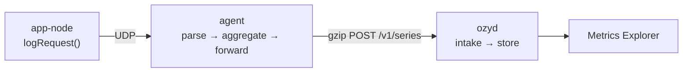

# M1 — Metrics tracer bullet

## What was built

One metric type, all the way through. An app calls `increment()`, and about
twenty seconds later the number is on a chart. Everything between those two
points now exists: an extended StatsD server, an aggregator, a forwarder with a retry
queue, an intake, a metric store, a query engine, a Metrics Explorer, and two
SDKs that send the bytes. app-node is the first real app on it.



The thing that makes this a *tracer bullet* rather than a demo: every piece is
the real one, only narrow. The store is a naive SQLite table instead of a
Gorilla-compressed TSDB, but it sits behind the `MetricStore` interface that
M2's engine will implement, and the intake, query engine and UI above it never
learn the difference.

## How it works

Follow one request through app-node:

1. A request finishes. `logRequest()` (already the single place both `handle()`
   and `authed()` report through) calls `recordRequest()` in the app's one
   telemetry seam, which calls `statsd.increment("http.request.count")` and
   `statsd.distribution("http.request.duration", ms)`.
2. The **SDK** formats `http.request.count:1|c|#route:/api/comics,...`,
   coalesces it with whatever else is buffered (up to 1432 bytes / 100 ms) and
   writes one UDP datagram. It never waits and never throws.
3. A **reader** goroutine in `internal/agent/statsd` receives the datagram into
   a 64 KiB buffer and hands it to a bounded queue. If the queue is full the
   datagram is dropped and counted — visible loss beats invisible memory
   growth.
4. A **worker** splits the datagram on newlines and calls `Parse`, which
   allocates nothing: the returned `Message` points into the read buffer. Names
   and tags are normalized (not rejected), and unknown sections like `|c:` are
   ignored.
5. The **aggregator** finds the context (`kind + name + canonical tags`) in a
   sharded map and adds the sample to the bucket for `floor(ts/10)*10`.
6. Every 10s the **flush** closes finished buckets: counters sum (and zero-fill
   forward), gauges take the last value, histograms emit six derived series
   from a reservoir. The agent adds its own `ozy.agent.*` metrics to the
   same flush.
7. The **forwarder** splits the flush into payloads of ≤5000 series / 2 MiB,
   gzips them, and POSTs `/v1/series`. On failure the payload goes on a 64 MiB
   drop-oldest queue and is retried with full-jitter backoff.
8. The **intake** validates each series independently, records the metric's
   type in `meta.db` (rejecting a later contradiction), and appends to the
   store.
9. **`/api/v1/query`** selects matching series, buckets them to an interval,
   groups by the requested tag keys, and aggregates across series. Empty
   buckets are `null`, which the UI draws as a gap rather than as zero.

DESIGN.md §9 and §10 are the permanent version of this; the diagram lives in
`docs/diagrams/metric-write-path.mmd`.

## Key concepts learned

**Aggregation is the product.** Before writing it I thought of the agent as a
relay with buffering. It isn't: 3,000,000 messages became 10 points per flush
in the load test — a 300,000× reduction before anything touched the network.
Every design choice in the agent follows from being the place where volume
collapses.

**Tag cardinality is the real constraint in a metrics system.** A tag value is
not a label on a chart, it is an axis of series identity: `route:/api/comics/<id>`
means one series per comic, forever, and nothing in the app will ever tell you.
This is why the app's `normalizeRoute` exists and why it is the one piece of the
integration with its own test.

**"Absent" and "zero" are different, and only the data model can tell them
apart.** A counter that stops incrementing must keep reporting 0, or a rate
chart shows a misleading gap; a gauge that stops reporting must *not* be filled,
because nobody took that reading. Getting this right is the difference between
a chart you can trust and one you learn to squint at.

**Bounded everything.** Every queue in the path has a cap and a documented
behaviour at that cap: the statsd queue drops newest and counts, the forwarder
queue drops *oldest* (recent data is worth more), the reservoir bounds memory
per histogram context, contexts expire. The unbounded version of each is easier
to write and fails by taking the process down.

**UDP's "unreliability" is mostly a batching problem.** 50k messages/s lost
nothing, because 20 messages per datagram makes it only 2.5k datagrams/s. The
same message rate unbatched is where loopback starts dropping.

## Trade-offs taken

| Decision | Why | What it costs |
|---|---|---|
| Naive SQLite store (row per sample) | The interface and everything above it can be built and tested now; M2 swaps the implementation | ~5.3 µs per series per append, and a database far larger than the data |
| Reservoir + nearest-rank percentiles | No sketch library, and the point is to write one in M2 | Percentiles are estimates from a sample, not from all values, and cannot be merged across hosts |
| Zero-fill counters, never gauges | Matches how each type is actually read | A counter context lives for `context_expiry` after its last data |
| Late samples into the oldest open bucket | A small error in *when* beats certain loss of *what* | A late sample is attributed to the wrong 10s bucket |
| Per-series rejection at the intake | One app's malformed series must not discard another's | The response is a list of reasons, not a status code |
| Drop-oldest forwarder queue | During a long outage, recent data is more valuable | A long enough outage silently loses the oldest window |
| Vendored SDK tarballs | Pre-1.0 and unpublished; `npm link` + Turbopack don't mix | `make sdk-release` must be rerun when the SDK changes |

## How the real systems differ

- **Production agents** send *sketches* (DDSketch) for distributions rather than
  six derived gauges, which is what makes `p99 by service` computable across
  hosts. Ours cannot be merged: six numbers per host per bucket are six numbers,
  not a distribution. M2 fixes this.
- **Real extended StatsD** also carries events (`_e{}`) and service checks (`_sc`),
  which we parse and deliberately drop — counted separately so "a client sends
  events" is distinguishable from "a client is broken". Production backends
  store both.
- **Prometheus inverts the direction**: it scrapes an endpoint the app exposes
  rather than receiving pushes. Pull makes "is it up?" free and makes
  short-lived jobs hard (hence their Pushgateway); push makes short-lived jobs
  trivial and makes liveness a separate question. Our cron-script example is
  exactly the case pull handles badly.
- **Prometheus's TSDB** stores a compressed chunk per series per two hours. Our
  naive store writes a SQLite row per sample — roughly 50 bytes where Gorilla
  would use 1–2 bits for a steady counter.
- **Production intake** is a queue (Kafka) with storage behind it; ours writes
  synchronously and returns 503 on failure, which is why the agent's retry
  queue is doing that job for now. ADR'd as M7's work.

## Measured numbers

Full table with methodology in [../benchmarks.md](../benchmarks.md). Machine:
Apple M5, macOS 26.6.2, Go 1.27.1.

| Path | Number |
|---|---|
| `Parse` one line | 45.2 ns, 0 allocations, 1.97 GB/s |
| Aggregator `Add` (existing context) | 268 ns, 2 allocations |
| Store append | 14.6 µs for 1 series, 5.3 µs per series at 100 |
| Store select, 360 points | 81.8 µs |
| Sustained ingest | 3,000,000 messages at 49,999/s for 60s, **0 lost (0.0000%)** |
| Agent memory under a 2-minute outage | 27,296 KB → 27,600 KB (+304 KB) |
| Smoke suite | 23 checks in 31s |

The aggregator, not the parser, is the expensive stage — 6× the parser's cost
per sample, and the only one that allocates on a steady-state path. At M1's
target rate it is 13 ms of CPU per second, so it is recorded rather than
optimized.

## Surprises and bugs

**Zero-fill measured from the wrong timestamp.** The fill walked forward from
the context's `lastSeen`, which a flush updates, so after a long quiet period
it would emit one zero per interval for the whole gap — thousands of points for
a context that had been idle all night. The fix was a separate `lastData`
field and a jump over long gaps. Found by a fake-clock test, not by load.

**`make dev` lost the last 23 series on Ctrl-C.** Both processes got SIGTERM at
the same moment, so the agent's final flush raced ozyd's shutdown and
usually lost. Shutdown has an order — agent first, always — and now `dev.sh`
and compose's `depends_on` both encode it.

**busybox `nc -w0` means "wait forever".** BSD `nc` reads `-w0` as "don't
wait", so the smoke test's first send hung a container for nine minutes before
I noticed. The same flag was in `examples/cron-script.sh`, where it would have
hung a real cron job on the one operation that was supposed to be
fire-and-forget. `-w1` is the portable form.

**Two ozyd instances answering the same port.** The compose stack was
still running while I tested natively, and macOS let a v6 bind and the Docker
v4 proxy coexist on 9400. The agent forwarded to one and my queries read the
other, so a working pipeline looked completely dead. The tell was the store
containing *someone's* metrics, just not the ones I had sent — worth
remembering as a shape: when data is missing, check you are reading the same
instance you wrote to.

**A load test that measured nothing.** The first 50k/s run reported 3M messages
sent and then could not reach the agent, because `dev.sh` exits when *any* of
its three processes exits and Vite had died twelve seconds in. A sender that
cannot see the receiver has measured nothing at all — UDP will happily report
success into a void.

**Real clients disagree with the spec's prose.** datadogpy appends a 64-char
`|c:` container id to every line and a `|card:` field this parser had never
heard of; both clients apply sample rates *client-side*, so a capture of their
output isn't even deterministic between runs. Hence
`scripts/capture-statsd-compat.sh`, which seeds their RNGs, and goldens that
pin how we interpret each real line.

## Acceptance evidence

**1. Browsing app-node moves `http.request.count by {route}` within ~20s.**

app-node ran as a throwaway instance (own port, own db, per its AGENTS.md);
20 API requests were issued, and ~25s later:

```console
$ curl -s ".../api/v1/query?metric=http.request.count&by=route&agg=sum&..."
  /api/boards                          Σ=10
  /api/comics/:id                      Σ=10
  /api/comics                          Σ=70
series: 3
$ curl -s ".../api/v1/tags/values?metric=http.request.count&key=route"
  ['/api/boards', '/api/comics', '/api/comics/:id']
  service       ['app-node']
  version       ['1.2.0']
  status        ['401']
  status_class  ['4xx']
$ curl -s ".../api/v1/metrics?prefix=http.request.duration"
  ['http.request.duration.95percentile', '...avg', '...count',
   '...max', '...median', '...min']
```

Three routes, not one per comic id — the normalizer works. Confirmed visually
in the Metrics Explorer: three series, 10s buckets, auto-refreshing.

**2. With ozymandias stopped, app-node behaves identically.**

```console
$ npm run typecheck && npm run lint && npm test    # OZY_AGENT_HOST unset
Test Files  26 passed (26)
     Tests  296 passed (296)
```

The suite includes a test that makes `recordRequest` throw and asserts the
request still returns 200, and one asserting the seam is callable and inert
when the agent is not configured.

**3. Killing ozyd for 2 minutes loses no flushed buckets.**

ozyd was killed for 115s under a steady 2,000 msgs/s:

```
T+20  killing ozyd (SIGTERM)
T+60  rss=27440KB queue_bytes=3320 retries=20 dropped=0
T+120 rss=27568KB queue_bytes=8308 retries=67 dropped=0
T+140 restarting ozyd (down 115s)
T+200 rss=27600KB queue_bytes=0    retries=89 dropped=0 sent=38
sent 400000 messages in 3m20s (2000 msgs/s)

total stored sum   : 3400000     (3,000,000 flood + 400,000 outage load)
delta              : 0
buckets in the outage window: continuous, every one exactly 20000
```

**4. 50k statsd msgs/sec for 60s with <0.1% drops.**

```console
$ ./bin/loadgen -scenario statsd-flood -rate 50000 -duration 60s
sent       3000000 messages in 1m0.001s (49999 msgs/s), 0 datagrams failed to send
received   3000000 messages (agent parsed)
dropped    0 datagrams in the agent's queue
lost       0 messages = 0.0000% (queue drops + kernel drops)
```

Stored total queried back: 3,000,000 across 100 series, 500,000 per bucket.

**5. Test-plan items and coverage gates.**

```console
$ scripts/check-coverage.sh
✓ total coverage 96.8% (gate 80%)
✓ pkg/wire: 100.0%            ✓ internal/agent/statsd: 96.0%
✓ internal/agent/aggregator: 99.1%   ✓ internal/tsdb: 100.0%
✓ internal/tsdb/naive: 91.4%  ✓ internal/query/simple: 98.0%
$ make smoke
smoke: 23 checks passed
```

Both SDKs are at ~98% with their own 90% gates, wired into `make ci`.

## Exercises

Things left deliberately, worth doing before or alongside M2:

1. Make `Add` allocation-free on the steady-state path (the context key is
   rebuilt per sample).
2. Send an unbatched 50k msgs/s and find where loopback starts dropping; the
   difference from the batched run is the value of the SDK's buffer.
3. Emit a `|T` timestamped point far in the past and follow what the aggregator
   and the query engine each do with it.
4. Point two agents with the same `host` tag at one ozyd and watch the
   last writer win, then decide whether that should be an error.
