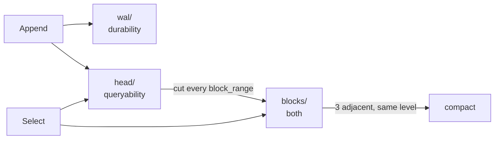

# M2 — The real TSDB

> **Scope.** M2 ships in two parts. This is part one: the storage engine, and
> `metric_store: tsdb` as the default. DDSketch, the sketch store, percentile
> aggregators and rollups are part two, and the acceptance criteria that
> depend on them are marked open at the bottom. Everything else here is done
> and measured.

## What was built

M1 stored one row per sample in SQLite. That works and it is honest about
what it is: `docs/notes/M1.md` called it a naive store behind the real
interface. M2 is the real one — a Gorilla-compressed, write-ahead-logged,
inverted-indexed, block-based time series database — and the naive store
stays, not as a fallback but as the **oracle** the new engine is held to in a
differential test.

Seven packages under `internal/tsdb/`, each one a thing worth understanding on
its own:

| Package | What it is |
|---|---|
| `chunkenc` | Gorilla compression: delta-of-delta timestamps, XOR'd floats, 120 samples per chunk |
| `wal` | the write-ahead log: framed records, segments, group commit, torn-tail recovery |
| `index` | the inverted index: postings lists per tag pair, galloping intersection |
| `head` | the in-memory window: series identity, live chunks, the ordering rules |
| `block` | an immutable block on disk: `meta.json`, `chunks.dat`, `index.dat` |
| `compact` | leveled compaction and the disk size cap |
| `db` | the seam that ties them together and implements `tsdb.MetricStore` |

## How it works

### The write path

`db.Append` hands a batch to the head, and the head does three things as one
indivisible step — the **commit**:

1. **Resolve.** Each `(metric, tags)` becomes a series id, created if new.
2. **Log.** One WAL record for any series being defined for the first time,
   one for the batch's samples. With `wal_sync_on_append` (the default) the
   fsync happens here, before anything is acknowledged.
3. **Apply.** Each sample is appended to its series' live chunk.

That those three are one critical section is not an implementation detail;
each boundary between them was a bug before it was a comment. See "Three ways
the store lost data" below.

Every `block_range` (2h by default), maintenance cuts the oldest complete
range out of the head and writes it as a block: freeze the range so nothing
below it is accepted any more, snapshot everything below it, write the block,
fsync, rename it into place, then drop those chunks from the head and truncate
the log. The order is the crash-safety argument: the block exists before
anything is forgotten, so a crash anywhere leaves the data in the log or in
the block, never in neither. A crash in the middle leaves it in *both*, which
replay handles by refusing samples a block already covers.

### The read path

`db.Select` merges the blocks that overlap the window with the head, oldest
first, so each source only ever appends to the end of what is already there.
A block narrows by time before it decodes anything: chunk references in the
index carry their own `minT`/`maxT`, so a 5-minute query against a 2-hour
block touches a handful of chunks, not all of them.

### The division of labour

The shape is LSM-ish, and the clarifying way to say it is by what each part
guarantees:

- the **log** gives durability and nothing else — it is append-only, opaque,
  and unqueryable;
- the **head** gives queryability and nothing else — it is in memory and
  would vanish on a crash;
- **blocks** give both, which is why data is only allowed to leave the other
  two once it is in one.

## Key concepts learned

**Delta-of-delta is the whole trick.** A counter scraped every 10 seconds has
timestamps whose *second* difference is zero. Gorilla spends one bit on that
case. The value side is an XOR against the previous sample, and for a value
that does not change that is also one bit. Two bits per sample for the most
common series in any real system — measured at 0.37 bytes/sample, 43× smaller
than the 16 bytes an `(int64, float64)` pair costs.

**An fsync costs the same whatever it flushes.** ~3.9 ms on this machine for
64 bytes or for 4 KiB. Every durability design follows from that one fact:
the only lever is how many writes share one, which is why the log batches, why
`Append` takes a whole batch rather than a sample, and why the same store does
25 661 or 1 641 320 samples/sec depending only on batch size.

**A negative matcher is a subtraction, not a complement.** `env!=prod` as
"everything except the postings for `env:prod`" means materializing the
universe. Starting from the positive matchers' intersection and subtracting is
the same answer for a fraction of the work — and it is why a selector with
only negative matchers has to be rejected rather than answered.

**Immutability buys atomicity for free.** A block is written into a `.tmp`
directory and renamed. Rename is atomic, so a block appears complete or does
not appear. Deletion runs the argument backwards: a tombstone is written
*before* anything is unlinked, so an interrupted delete is finished at startup
rather than leaving a block missing half its files.

## Trade-offs taken

**In-order ingestion only** (ADR-0011). A sample at or before a series' newest
timestamp is refused, except for an exact duplicate, which is accepted as a
no-op so that an at-least-once retry is idempotent. Out-of-order support means
either rewriting chunks or keeping a second write path; Prometheus went years
without it. The cost is visible: shorten `block_range` for a test and
backfilled points start being refused, because the head's writable window
shrinks with it.

**The index lives in memory**, in the head and in each open block. That bounds
how many series an ozymandias can hold by RAM, which is the same bound Prometheus
has, and it is why `max_series_per_metric` exists at all.

**Retention deletes whole blocks.** A block is immutable, so expiring part of
one means rewriting it. The oldest data therefore outlives the retention
window by up to one block range — which makes `block_range` a retention
granularity decision as much as a compaction one.

**The commit is serial.** Appends do not overlap: 64 appenders are slightly
slower than one. With one agent posting a large batch every 10 seconds this is
free, and the measurement says so. With sixty agents it would not be, and the
fix is a real group commit — the queued appenders riding along on one fsync
rather than each taking their own. Recorded as a limit, not fixed.

## How the real systems differ

**Prometheus** is the design this follows most closely, and the differences
are all about scale. Its head chunks are mmap'd to disk once full, so the head
is not bounded by RAM the way ours is. Its WAL is periodically *checkpointed*
— rewritten with dead series dropped — where ours copies series records
forward on truncation and never compacts them. It keeps deletion tombstones
inside blocks so `DELETE` can be honoured without a rewrite; ours has no
delete API at all. And its compaction plans over the whole block set with size
and time heuristics, where ours takes the first three adjacent same-level
blocks it finds.

**Production backends** do not put the intake in front of the storage engine
like this at all: points land on a queue, and storage is a separate service
reading from it, which is what lets ingestion survive a storage outage without
a retry queue in every agent. Their distributions are sketches, computed in the
agent — which is M2 part two here.

**VictoriaMetrics** makes the opposite call on ingestion order: it accepts
out-of-order samples and sorts during merge, which is why backfilling into it
just works and why its write path is more complicated than this one.

## Measured numbers

Full tables in `docs/benchmarks.md`. The ones that matter:

| | |
|---|---|
| Compression, constant series | **0.37 B/sample** — 43.6× vs raw |
| Compression, wobbling gauge | 4.59 B/sample — 3.5× |
| On disk, realistic block | 4.87 B/sample, of which the index is 4% |
| Ingest, sync-on-append, 1000/batch | **231 638 samples/sec** |
| Ingest, sync-on-append, 100/batch | 25 661 samples/sec |
| Ingest, group commit, 1000/batch | 3 207 454 samples/sec |
| Restart with a 1.00 GiB log | **3.79 s**, all 76 790 000 samples restored |
| fsync | ~3.9 ms, independent of size |
| Append vs the naive store | 205× faster (1 series), 60× (1000) |
| Select vs the naive store | 19× faster |

## Surprises and bugs

### Three ways the store lost data

The stress test — 16 appenders, 4 selectors and a goroutine cutting and
compacting underneath them, under `-race` — found three separate ways to
acknowledge a sample and then lose it. All three were mine, all three were
invisible to every other test in the package, and the reason is the same: each
of those tests holds one thing still in order to look at another.

1. **Compaction closed a block a query was reading.** Blocks left the
   database's list and had their files closed immediately; a query that
   snapshotted the list a moment earlier was still reading `chunks.dat` and
   got "file already closed" — an error returned to a user for a block that
   was *merged*, not lost. Blocks now count their readers, acquired under the
   lock that guards the list, and the close waits for the last one out.

2. **A block cut dropped samples that arrived while it ran.** The cut
   snapshotted the head, wrote the block, then truncated the head to the same
   boundary. A sample below the boundary accepted in between was
   acknowledged, left out of the block, and then dropped by the truncate.
   `Head.Freeze` now closes the range *before* the snapshot, which converts a
   silent loss into an honest `ErrOutOfBounds` for the few samples involved —
   they were about to be refused a moment later anyway.

3. **Truncate forgot a series an appender was still holding.** Dropping a
   series means removing it from the shard map, the id map and the postings.
   An appender that had already resolved that series still held the pointer
   and appended into an object no index could reach. This is what forced
   resolve/log/apply into one critical section.

And a fourth, found by the same test after those: the cut read the head with
`Stats().MinT` as its lower bound. `Stats` lists the series under a lock and
then walks them without one, so a series created *during* the walk contributes
nothing to `MinT` — and its already-acknowledged samples fell below the
snapshot's floor and were truncated away unwritten. The rule the code now
states: the block must cover exactly what the truncate throws away, so the
snapshot has no lower bound at all. `Stats` decides *whether* to cut; it does
not get to decide what the cut contains.

The general lesson is not "write a stress test". It is that every one of these
lived in the gap between two operations that each looked correct — and that a
test which never holds anything still is the only kind that can see a gap.

The recovery bugs below are the same lesson from the other direction: the gaps
there were between a *run* and a *restart*, and no amount of concurrency
testing reaches them.

### Three more that a code review found, all in recovery

The stress test and the crash loop both exercise a *running* store. None of
them restarts it with a log big enough to have rolled a segment, and that is
where the worst bug in the milestone was hiding.

**The log was truncated to the current segment.** A block cut truncates the
write-ahead log, on the reasoning that everything older than the cut is now on
disk. The reasoning has a premise nobody stated: that the samples still in the
head were written to the segment currently open. Segments roll at 32 MiB and
the head keeps up to 1.5 block ranges, so on any real write rate the head's
oldest samples are several segments back — and those samples exist *only* in
memory and in the log. Measured: **1 987 440 of 3 232 730 acknowledged samples
gone across a clean shutdown and restart**, 61% of the database. The checkpoint
now keeps a sample record if any of its samples is at or after the head's
minimum valid time, which is the line between "in a block" and "only here".

Every existing restart test wrote a few kilobytes, so the log never rolled and
the premise was accidentally true. That is the thing to take from it: a test
can be green because the code is right, or because the test is too small to
reach the case. Those look identical from the outside.

**A torn tail was detected and then left in place.** `wal.TruncateTail` existed,
was correct, was documented "must be called before any new append" — and had no
callers outside its own test. Replay stops at a torn record, quietly and
correctly, because that is what an interrupted write looks like. But the next
process then appended *behind* it, so every subsequent write went somewhere no
replay could reach: acknowledged, served from memory, and gone at the next
restart. One lost record became unbounded silent loss. There is now a
`wal.Repair` that runs before the log is opened for writing.

**The metadata queries raced the head's index.** `MemPostings` is documented
"not safe for concurrent use; the head serializes access", and the metadata
path took the live pointer and called it with no lock. `Head.Select` got this
right; the metric-name and tag-value queries did not. Go does not turn a map
read racing a map write into a wrong answer — it turns it into a fatal error
that kills the process — so any `/api/v1/tags` request during intake could take
ozyd down. The head now hands out a `Lookup` that takes the lock per call
instead of handing out the map.

Three smaller ones came with them: retention did not take the lock compaction
holds, so an operator calling it by hand could close a block mid-merge; the
head decided chunk boundaries with truncating division while the block cut used
floor division, which disagree either side of the epoch and let a chunk
straddle a cut; and a failed log write left a partial record with no way back,
so later writes queued behind bytes replay could not pass — the log now refuses
to continue rather than accepting data it knows it will lose.

### And two more, after the first round of fixes

A second review of the fixed branch found two more, which is the useful part
of the story: the first round's fixes were themselves wrong in one place.

**Replay dropped a series that came back.** The ordinary life of a bursty
series: it reports, a block cut takes it and the head forgets it, it reports
again and `getOrCreate` gives it a *new* id, because the old one went with the
block. Both series records are in the log. Replay's `restoreSeries` returned
early if it already had that series *key*, so the second id was never
registered, and every sample logged against it resolved to nothing and was
counted as skipped. Fixed by having replay keep its own log-id → series map
instead of borrowing the head's: several ids naming one series is a property
of the log, not of the head, and the head should hold one identity per key.

**Locking the index per call was not enough.** The metadata race above was
fixed by handing out a `Lookup` that takes the head's read lock on every call.
That makes each map read atomic and leaves the real problem: what the read
*returns* is the index's own postings slice, and head GC edited those in place
with `append(list[:i], list[i+1:]...)`. A query walking the slice while a
block cut removed a series from it is the same race one level down. Postings
lists are now immutable once handed out — the two paths that shift elements
build a new list, while appending past the end stays in place, because a
reader's slice header stops at the old length and cannot see the new element.

Three smaller ones came with them: `Close` used a check-then-act on its done
channel, so two goroutines racing through shutdown could both close it and the
second would panic; `/debug/vars` walked the whole head six times per scrape,
once per gauge; and the bitstream's byte-aligned fast path tested `count == 8`
where `count` is the *free* bits in the last byte and is never 8 on entry, so
it had never executed — writing was 10–18% slower than it needed to be, with
byte-identical output, which is exactly why nothing caught it.

One finding is answered rather than fixed. Checkpoints keep every series
record forever, so under label churn the checkpoint grows without bound and
replay time with it. That is real, and the obvious fixes are not safe: keeping
only the records for ids the head holds breaks when a restart leaves the head
holding the *older* of two ids for one key; deriving the set from the kept
sample records in one pass fails because a series record is met before the
samples that need it; and deriving it from the doomed segments alone misses a
series whose live samples are in the segment that survives. The correct fix
scans the surviving segments too, and belongs in its own change with its own
tests rather than bolted onto the file where two data-loss bugs have already
been found.

### Round three: no data loss, and a check that proved nothing

A third review found nothing in the durability core — the chunk resume
arithmetic, the log's torn-tail repair, the block rename-as-commit, the
freeze-then-truncate ordering, the postings immutability and the block reader
counting all traced clean. What it found instead was a gap in the *cleanup*
after a crash, and a test that was lying.

**A crash between a merge and its cleanup left the data twice, forever.**
Compaction writes the merged block, renames it into place, and only then
deletes the sources. That order is right — a crash leaves the data twice
rather than not at all — but nothing finished the job afterwards. The comment
claimed the sources would carry tombstones that startup would find; tombstones
are written *inside* the delete that never ran. So the sources stayed:
invisible to queries, because `Select` dedups the overlap, and fully charged
against `max_bytes`. Worse, the next compaction merged the same run again into
a second identical block that no later pass could reduce, because a run needs
three. Startup now deletes any block that a surviving block's meta names as
one of its sources — one pass is enough even for a chain of interrupted
compactions, because the intermediate blocks are still on disk and their own
source lists are read in the same sweep.

**The smoke test's restart check tested nothing.** `data survived the restart`
was a verbatim repeat of a query three lines above it, and the SIGTERM cycle it
claimed to be checking happened earlier in the script than the writes it was
asserting on. Every sample it looked at had been written *after* the last
restart. So the one end-to-end exercise of write-ahead-log replay in the whole
suite was a tautology — in a milestone where replay is where every serious bug
turned out to live. The restart now happens between the writes and the check.

That one is the more uncomfortable of the two. A test that never fails looks
exactly like a test that passes.

And a coda, because it is the best argument for the fuzz gate in the whole
milestone: the fix for one of round three's smaller findings — copying a
borrowed buffer before appending to it — sized the new buffer from where the
*payload* ended rather than from the buffer's own length, which is a capacity
below the length, which panics. `FuzzChunk` found it on the very next run,
inside the function that had just been written to make things safer. A chunk
whose header claims fewer samples than the bytes behind it is one bit-flip
away from any real chunk. The crasher is committed as a corpus file, with a
named test beside it so the reason outlives the opaque bytes.

### A `.tmp` block that looked complete

The crash loop found this one on its first run. `meta.json` is written last
inside the temporary directory, so the cleanup at startup judged a directory
by whether it had one. A process killed in the window between that write and
the rename leaves a `.tmp` directory that is complete in every respect except
the one that counts. It was kept forever — invisible to queries, because
`OpenAll` skips `.tmp`, and still charged against the disk size cap. The
rename is the commit, not the `meta.json`, so the suffix alone now condemns a
directory.

### WAL order was not apply order

Two goroutines appending to one series could be logged in one order and
applied in the other, so replay reconstructed a set of samples the head never
had. Then, after fixing that by widening the lock: the series *definition*
record was written by whoever created the series, but an appender that merely
*found* it could reach the log first and write samples pointing at an id the
log had not defined yet — replay dropped them. Half the samples in the test
disappeared. Which series need declaring is now decided at the log, in log
order, not at creation.

### Two blocks in the same millisecond

`NewULID` seeded its entropy from the timestamp it was encoding, which makes
the id a pure function of the millisecond. Two blocks cut inside one got
identical ids and the second's rename collided. Entropy is now drawn once from
a shared `ulid.Monotonic` source, which also keeps same-millisecond ids in
creation order.

### A panic that could not happen yet

A property test resuming an appender on a decoded chunk panicked with `slice
bounds out of range` — the resume path re-reads the stream to find the tail
and indexed one past the end when a chunk happened to end on a byte boundary
with no spare capacity. Both production callers only ever resume a chunk they
just created, which always has spare capacity, so it was latent. It would have
stopped being latent the first time anything resumed a chunk read from a
block.

### Short block ranges reject backfill

Not a bug, but it cost an hour. Setting `block_range: 10s` to watch cuts
happen made every backdated test point bounce: the writable window is
~1.5 × `block_range` behind a series' newest sample, and ozyd's own
self-metrics keep that sample moving. Correct behaviour, thoroughly surprising
in a test. It is now called out in `docs/operations.md` and in the config
reference.

## Acceptance evidence

| Criterion | Status |
|---|---|
| `metric_store: tsdb` default; charts unchanged vs naive | ✅ differential test green |
| ≤ 2 bytes/sample for a realistic 10s series | ⚠️ **0.37 B** for a counter, **4.59 B** for a wobbling gauge — met for the common case, not for a gauge whose low bits move every sample |
| Crash loop 50×; torn-write suite | ✅ 50 SIGKILLs, every recovery a valid prefix |
| Ingest ≥ 200k samples/sec with sync-on-append | ✅ **231 638/sec** (1000-sample batch) |
| 1 GiB WAL replays in < 30s | ✅ **3.79 s** |
| Blocks cut, compacted and expired over 3 simulated days | ✅ 35 cuts, 14 compactions to level 2, 33 expired |
| `p95:...` within 1% of exact | ⛔ part two (DDSketch) |
| Format goldens: a committed chunk, log segment and block | ✅ `docs/formats/README.md` lists them |
| Docs deliverables; notes with evidence and numbers | ✅ this file, `docs/formats/`, `docs/benchmarks.md` |

The differential test is the central correctness argument: the same random
workload against the TSDB and against the naive SQLite store, comparing every
`Select`, `TagKeys` and `TagValues`, plus a restart. Two genuine
specification disagreements came out of it and are documented rather than
papered over — what an empty metric name means to each store, and the fact
that block cuts create a boundary the oracle has no concept of.

## Exercises

1. Make the commit a real group commit: let appenders queued on the lock share
   one fsync, and see whether the 64-goroutine number stops being worse than
   the 1-goroutine one.
2. Checkpoint the WAL properly — drop series records for series the head no
   longer holds — and measure the replay time of a log that has been running
   for a week.
3. Add out-of-order support behind a flag, in the cheapest way that works (a
   second head for late samples, merged at block cut), and find out what it
   costs the read path.
4. Delete a chunk's bytes from a `chunks.dat` and follow exactly which layer
   notices: the crc32c, the index, or the iterator.
